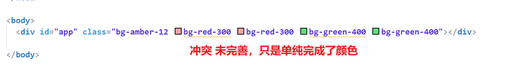
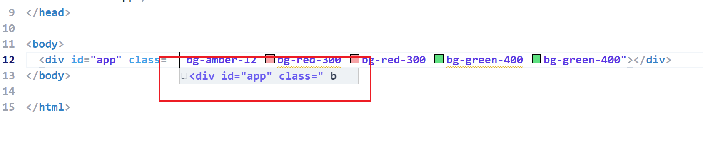
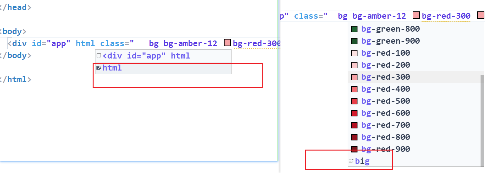

## Bug

1. class 冲突

2. 正则卡死(编辑的时候修改属性动作过快导致卡死) (修改正则后期修复)

3. 格式化光标位置会出现问题

4. html 快捷生成标签匹配错误(OK 修改正则)

5. 不该出现的提示出现了

## 已实现

1. 关闭颜色提示 hover(或获取最后的 hover 列表,并且过滤) （OK 自定义 field）

## 未实现的 Api(没找到, 能力有限)

1. 可以在最后获取提示列表,并且过滤掉不需要的内容 (Ok 待解决，只有方法)
2. 提示列表在输入的时候不能一直存在(提示内容为当前输入内容) (Ok 待解决，暴力解法)

## 更新

1. 插件系统完善
2. 格式化光标位置重置
3. class 中类型相同 Eslint 报黄
